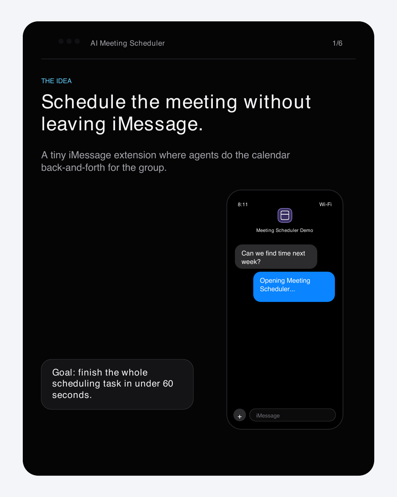
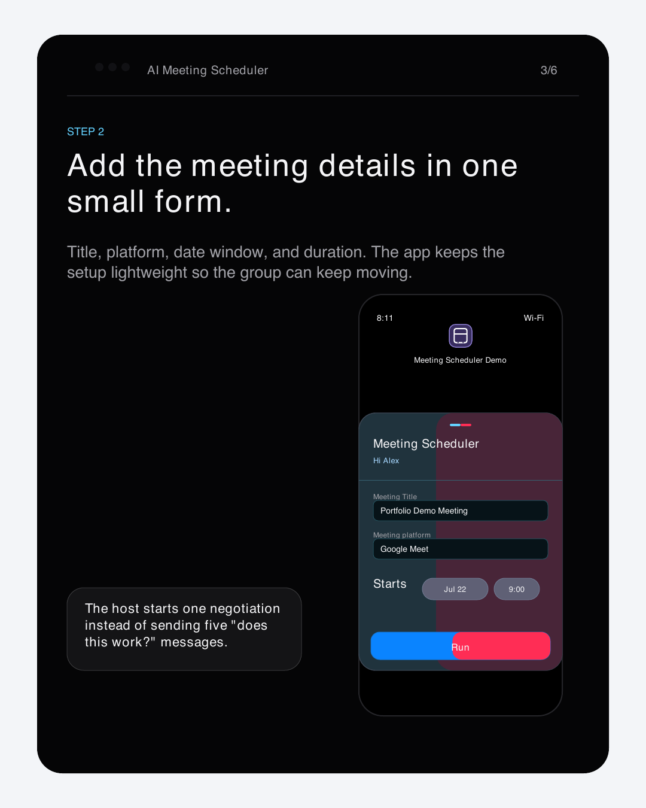
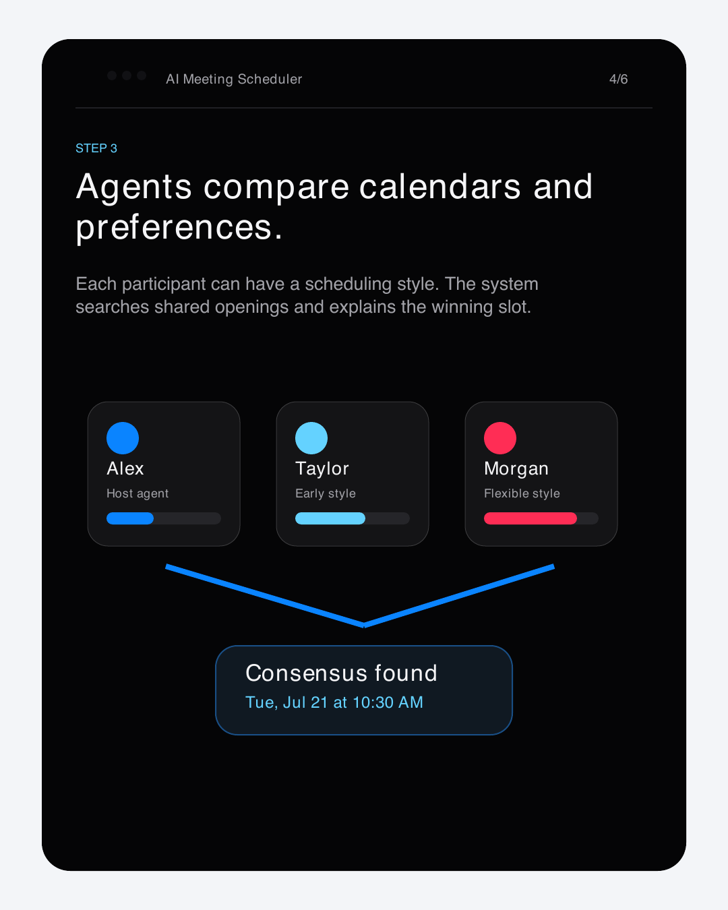
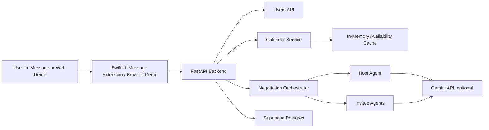

# AI Multi-Agent Meeting Scheduler for iMessage

An iMessage extension and FastAPI backend where scheduling agents negotiate meeting times for a group chat. The system turns the usual "does this time work?" back-and-forth into a structured negotiation: the host proposes slots, each participant agent evaluates those slots against availability and preferences, and the backend returns a consensus time, a partial consensus, the next common opening, or a clear no-consensus result.

The project is built as a working technical prototype: an iOS Messages extension for the native product experience, a public browser demo for portfolio visitors, deterministic calendar math for reliability, Gemini-backed agent reasoning when requested, and fallback behavior so demos still work without a model key.

## Demo

### iMessage Product Flow

<p align="center">
  
  &nbsp;&nbsp;&nbsp;&nbsp;
  
</p>

<p align="center">
  <sub>Open the scheduler inside iMessage</sub>
  &nbsp;&nbsp;&nbsp;&nbsp;&nbsp;&nbsp;&nbsp;&nbsp;
  <sub>Submit meeting details and invitees</sub>
</p>

### Project Story Visuals

These images were created for the project walkthrough and are kept in the repo so the README renders consistently on GitHub.

<p align="center">
  
  
  
</p>

## What It Does

- Runs as an iMessage extension so scheduling starts inside the conversation.
- Registers hosts and invitees with scheduling styles: `early`, `balanced`, or `flexible`.
- Accepts explicit busy blocks or generates deterministic mock calendar data for demos.
- Converts busy calendar intervals into valid free slots using testable calendar logic.
- Runs a bounded multi-agent negotiation with one host agent and one personal scheduling agent per invitee.
- Supports deterministic demo mode by default.
- Supports personalized AI mode when a user supplies a Gemini API key for the current request.
- Stores users and negotiation sessions in Supabase when configured.
- Falls back to temporary in-memory demo storage when Supabase is unavailable.
- Serves a public browser demo from the same FastAPI app at `/demo/`.

## How The Negotiation Works

1. The host creates a meeting request with a title, duration, date range, working hours, and invitees.
2. The calendar service loads supplied busy blocks or generates mock busy blocks.
3. Deterministic availability logic calculates free slots for every participant.
4. The host agent proposes up to three candidate meeting slots.
5. Invitee agents respond with `ACCEPT`, `COUNTER`, or `REJECT`.
6. The host refines proposals using counter-slots when needed.
7. The orchestrator stops after consensus or after the configured maximum of three rounds.
8. If no exact consensus is reached, the system looks for the best partial consensus or next common available slot.

## Negotiation Outcomes

| Result | Meaning |
| --- | --- |
| `CONSENSUS` | Every invitee accepted the same proposed slot. |
| `PARTIAL_CONSENSUS` | The system found the best accepted proposed slot after all rounds. |
| `NEXT_AVAILABLE` | No proposal won, so the scheduler selected the next slot free for all participants. |
| `NO_CONSENSUS` | No shared availability could be found within the requested range. |

The persisted session status maps successful scheduling outcomes to `pending_approval`, leaving room for a future host confirmation step before a meeting is finalized.

## Architecture



### Key Design Choice

Calendar correctness is handled outside the model. The AI agents can reason about preferences, but they do not decide whether someone is free. Availability is computed by deterministic Python logic, stored for the session, and checked again before consensus is accepted.

## Tech Stack

| Layer | Tools |
| --- | --- |
| iMessage client | SwiftUI, Messages extension |
| Backend API | FastAPI, Python 3.11+, Uvicorn |
| Agent reasoning | Google Gemini via `google-genai`, deterministic fallback mode |
| Persistence | Supabase/Postgres for users and negotiation sessions |
| Demo frontend | Static HTML, CSS, JavaScript served by FastAPI |
| Deployment | Render web service, `render.yaml`, `Procfile` |
| Tests | Python `unittest`, FastAPI `TestClient` |

## Repository Structure

```text
.
|-- backend/
|   |-- main.py                         # FastAPI app, routers, /health, /demo mount
|   |-- api/                            # Users, calendar, agents, negotiation, demo metrics
|   |-- agents/                         # Host and personal scheduling agents
|   |-- calendar_service/               # Busy block generation and free-slot calculation
|   `-- negotiation/                    # Multi-round negotiation orchestrator
|-- ios/MeetingScheduler/               # iOS app and Messages extension
|-- web_demo/                           # Public browser demo UI
|-- docs/                               # System design, deployment, launch, portfolio notes
|-- docs/assets/                        # README and project walkthrough images
|-- scripts/                            # Smoke tests and Supabase helper SQL
|-- tests/                              # Calendar, agent, and API tests
|-- requirements.txt                    # Render-friendly Python dependencies
|-- pyproject.toml                      # Project metadata and Python dependency list
`-- render.yaml                         # Render blueprint
```

## API Overview

| Method | Route | Purpose |
| --- | --- | --- |
| `GET` / `HEAD` | `/health` | Deployment health check. |
| `POST` | `/users/register` | Register a user with a display name and scheduling style. |
| `GET` | `/users/{user_id}` | Fetch a registered user. |
| `POST` | `/calendar/availability` | Calculate and cache free slots from busy blocks or mock calendar data. |
| `GET` | `/calendar/availability/{user_id}/{session_id}` | Read cached free slots for a session. |
| `POST` | `/negotiation/start` | Run a host/invitee scheduling negotiation. |
| `GET` | `/negotiation/{session_id}` | Fetch persisted or temporary negotiation status. |
| `GET` / `POST` | `/demo/love` | Track public demo appreciation count. |
| `GET` | `/demo/` | Browser-based portfolio demo. |

## Example API Calls

Register a user:

```bash
curl -X POST http://127.0.0.1:8000/users/register \
  -H "Content-Type: application/json" \
  -d '{
    "display_name": "Alex",
    "scheduling_style": "balanced"
  }'
```

Calculate availability:

```bash
curl -X POST http://127.0.0.1:8000/calendar/availability \
  -H "Content-Type: application/json" \
  -d '{
    "user_id": "alex-user-id",
    "session_id": "demo-session",
    "date_range_start": "2026-03-02",
    "date_range_end": "2026-03-06",
    "duration_minutes": 60,
    "density": "medium"
  }'
```

Start a deterministic negotiation:

```bash
curl -X POST http://127.0.0.1:8000/negotiation/start \
  -H "Content-Type: application/json" \
  -d '{
    "host_user_id": "host-1",
    "host_display_name": "Alex",
    "host_scheduling_style": "balanced",
    "invitees": [
      {
        "user_id": "invitee-1",
        "display_name": "Taylor",
        "scheduling_style": "early"
      },
      {
        "user_id": "invitee-2",
        "display_name": "Morgan",
        "scheduling_style": "flexible"
      }
    ],
    "meeting_title": "Portfolio Demo Meeting",
    "duration_minutes": 60,
    "date_range_start": "2026-03-02",
    "date_range_end": "2026-03-06",
    "working_hours_start": 9,
    "working_hours_end": 18,
    "use_ai": false
  }'
```

Start a personalized Gemini-backed negotiation:

```bash
curl -X POST http://127.0.0.1:8000/negotiation/start \
  -H "Content-Type: application/json" \
  -H "X-User-Gemini-Key: YOUR_GEMINI_API_KEY" \
  -d '{
    "host_user_id": "host-1",
    "host_display_name": "Alex",
    "host_scheduling_style": "balanced",
    "invitees": [
      {
        "user_id": "invitee-1",
        "display_name": "Taylor",
        "scheduling_style": "early"
      }
    ],
    "meeting_title": "AI-assisted planning session",
    "duration_minutes": 30,
    "date_range_start": "2026-03-02",
    "date_range_end": "2026-03-06",
    "use_ai": true
  }'
```

## Local Development

Create and activate an environment:

```bash
python3 -m venv .venv
source .venv/bin/activate
pip install -r requirements.txt
```

Run the backend:

```bash
cd backend
uvicorn main:app --host 127.0.0.1 --port 8000
```

Open the web demo:

```text
http://127.0.0.1:8000/demo/
```

Open the API docs:

```text
http://127.0.0.1:8000/docs
```

## Environment Variables

| Variable | Required | Notes |
| --- | --- | --- |
| `SUPABASE_URL` | Recommended | Enables persistent users, sessions, and demo-love storage. |
| `SUPABASE_KEY` | Recommended | Supabase anon or service key used by the backend. Do not expose service-role keys to clients. |
| `GEMINI_API_KEY` | Optional | Enables server-side Gemini agent responses when no per-request key is provided. |
| `DEMO_LOVE_REQUIRE_PERSISTENCE` | Optional | Set to `true` to fail instead of using local demo-love storage. |

For public demo runs, `/negotiation/start` defaults to `use_ai: false`. Personalized browser demo reruns can send `use_ai: true` with `X-User-Gemini-Key`; that key is used for the request and is not stored by this codebase.

## Testing

Run the test suite from the repo root:

```bash
.venv/bin/python -m unittest discover -s tests
```

Run the static route smoke check:

```bash
.venv/bin/python - <<'PY'
import sys
sys.path.insert(0, 'backend')
from fastapi.testclient import TestClient
from main import app

client = TestClient(app)
for path in ['/', '/demo/', '/demo/app.js', '/health']:
    response = client.get(path, follow_redirects=False)
    print(path, response.status_code)
PY
```

Run the deployed backend smoke test:

```bash
.venv/bin/python scripts/smoke_test_render_backend.py https://your-service.onrender.com
```

## Deployment

The repo is configured for Render.

Build command:

```bash
pip install -r requirements.txt
```

Start command:

```bash
cd backend && uvicorn main:app --host 0.0.0.0 --port $PORT
```

Health check path:

```text
/health
```

Render can be configured manually from the dashboard or with `render.yaml`. After deployment, verify `/health`, `/demo/`, and the API docs.

## Current Project Status

Completed:

- FastAPI backend with user, calendar, negotiation, agent, health, and demo metrics routes.
- SwiftUI/iMessage extension source.
- Public browser demo served by the backend.
- Deterministic mock calendar generation.
- Free-slot calculation from busy blocks.
- Host and invitee scheduling agents.
- Gemini support through `google-genai`.
- Deterministic fallback behavior when AI is unavailable.
- Supabase-backed users and negotiation sessions when configured.
- Temporary local fallback storage for demo resilience.
- Render deployment configuration and smoke-test script.
- Documentation for system design, launch plan, web demo, and deployment.
- Project walkthrough images for GitHub and portfolio use.

Known limitations:

- Availability is currently cached in process memory and should move to Supabase, Postgres, or Redis before horizontal scaling.
- Negotiation runs synchronously inside the request-response cycle.
- Authentication and Supabase Row Level Security are still production TODOs.
- Real calendar integrations are not implemented yet; demos use mock busy blocks or explicit request-provided busy blocks.
- The iMessage extension is harder for casual visitors to try, which is why the browser demo exists.
- Public deployment should avoid storing detailed calendar event content and should prefer free/busy data only.

## Production Roadmap

- Persist availability in shared storage so multiple backend instances can serve the same session.
- Move negotiation work into a background queue and return status through polling or realtime updates.
- Add authentication and user-scoped authorization policies.
- Enable Supabase Row Level Security before real user data is stored.
- Add Google Calendar or Apple Calendar free/busy OAuth integration.
- Encrypt calendar tokens and avoid storing full event details unless strictly necessary.
- Add structured logs, rate limits, retry handling, and provider health checks.
- Add a host approval step that transitions sessions from `pending_approval` to `confirmed` or `cancelled`.

## Documentation Index

- [System Design Brief](./docs/SYSTEM_DESIGN.md)
- [Public Web Demo](./docs/WEB_DEMO.md)
- [Render Deployment](./docs/RENDER_DEPLOYMENT.md)
- [3-Day Launch Plan](./docs/LAUNCH_PLAN.md)
- [Portfolio and Outreach Drafts](./docs/PORTFOLIO_AND_OUTREACH.md)
- [TODO](./docs/TODO.md)

## Interview Talking Points

- The system separates deterministic availability from AI preference reasoning.
- Agent roles model a real scheduling interaction: host proposes, invitees evaluate, host refines.
- The bounded three-round orchestrator keeps the multi-agent flow explainable and testable.
- The backend can run without an LLM, making demos reliable and easier to test.
- The next scaling step is turning the backend stateless and moving negotiation to async jobs.
