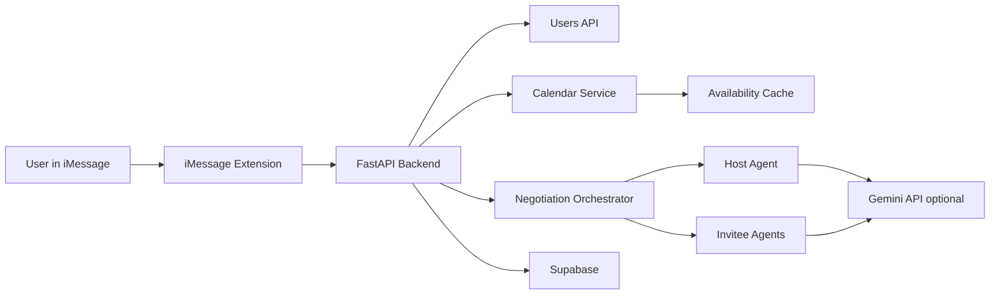

# System Design Brief

## One-Sentence Summary

AI Meeting Scheduler is an iMessage-based scheduling assistant where a host agent and participant agents negotiate meeting times using calendar availability, scheduling preferences, and multi-round proposal refinement.

## Core Components

## iMessage Extension

The iOS/iMessage extension is the user-facing client. It collects meeting details, user identity, scheduling style, and invitee information, then calls the backend APIs.

Responsibilities:

- Register or fetch users.
- Submit calendar availability or mock busy blocks.
- Start a negotiation session.
- Display the agreed slot or negotiation result.

## FastAPI Backend

The backend exposes the project API.

Main routes:

- `/health`: deployment health check.
- `/users/register`: create a user profile.
- `/calendar/availability`: calculate and cache free slots.
- `/negotiation/start`: create a session and run multi-agent negotiation.
- `/negotiation/{session_id}`: fetch negotiation status.

## Calendar Service

The calendar service converts busy blocks into usable free slots.

Current behavior:

- Accepts busy calendar intervals.
- Generates deterministic mock busy blocks when real calendar data is absent.
- Calculates weekday working-hour availability.
- Stores availability by user and session.

Why this matters:

- Calendar math is deterministic and testable.
- AI agents do not decide whether a user is free; they evaluate known valid slots.

## Agent Layer

There are two agent roles:

- Host agent: proposes candidate meeting slots.
- Personal scheduling agent: accepts, counters, or rejects proposals for an invitee.

Each agent uses a scheduling style:

- `early`: prefer earlier slots.
- `balanced`: prefer reasonable middle-ground slots.
- `flexible`: prefer less dense or later options.

The implementation supports Gemini responses when `GEMINI_API_KEY` is configured, with deterministic fallback logic when AI is unavailable.

## Negotiation Orchestrator

The orchestrator coordinates the meeting negotiation.

Flow:

1. Generate or load availability for host and invitees.
2. Host proposes a small set of candidate slots.
3. Invitee agents evaluate proposals.
4. If all invitees accept the same slot, consensus is reached.
5. If not, invitee counter-proposals inform the next round.
6. After a fixed number of rounds, return consensus, partial consensus, or no consensus.

Current maximum rounds: 3.

## Data Model

Supabase stores durable entities:

- Users
- Negotiation sessions
- Session status
- Final slot
- Negotiation logs

Current in-memory state:

- Per-user, per-session calculated availability.

Production improvement:

- Move availability cache into Supabase or Redis so multiple backend instances can share state.

## Current Architecture

## Scaling Plan

## 1. Stateless Backend Instances

Problem:

- In-memory availability does not work when traffic is split across multiple server instances.

Solution:

- Store availability in Supabase, Postgres, or Redis.
- Keep FastAPI instances stateless.
- Use a load balancer in front of multiple app instances.

## 2. Async Negotiation Jobs

Problem:

- Negotiation currently runs inside the request-response cycle.

Solution:

- Create a negotiation session immediately.
- Queue negotiation work in a background worker.
- Let clients poll `/negotiation/{session_id}` or subscribe to realtime updates.

Candidate tools:

- Celery/RQ with Redis.
- Supabase realtime updates.
- A managed queue such as Cloud Tasks, SQS, or Railway/Render background workers.

## 3. Calendar Integrations

Problem:

- Real calendar integrations require OAuth, token refresh, and permission boundaries.

Solution:

- Integrate Google Calendar or Apple Calendar with explicit consent.
- Store encrypted refresh tokens.
- Fetch only free/busy data when possible.
- Avoid storing full event details unless required.

## 4. Privacy And Security

Needed before production:

- Enable Supabase Row Level Security.
- Add policies so users can access only their own profiles and sessions.
- Avoid exposing service-role keys to clients.
- Add authentication.
- Limit stored calendar data to the minimum needed.

## 5. Reliability

Recommended additions:

- Request validation and clearer API errors.
- Structured logs with session IDs.
- Retry logic for LLM failures.
- Rate limits for public endpoints.
- Health checks for Supabase and model provider dependencies.

## Interview Talking Points

- I separated deterministic calendar math from AI decision-making so the most important correctness constraint is testable.
- I used agent roles to model a real scheduling negotiation: the host proposes, invitees evaluate, and the host refines.
- The system currently supports AI and deterministic fallback behavior, which makes demos more reliable.
- The next production step is making the backend stateless by moving availability out of process memory.
- For scale, I would move negotiation into asynchronous jobs and return session status through polling or realtime updates.

## Known Tradeoffs

- The current backend is optimized for prototype speed, not production durability.
- The in-memory availability cache is simple and fast locally but must be replaced before horizontal scaling.
- Running negotiation synchronously keeps the API simple but can create latency as agent count grows.
- Mock calendar data is useful for demos but real adoption needs OAuth-based calendar integration.

